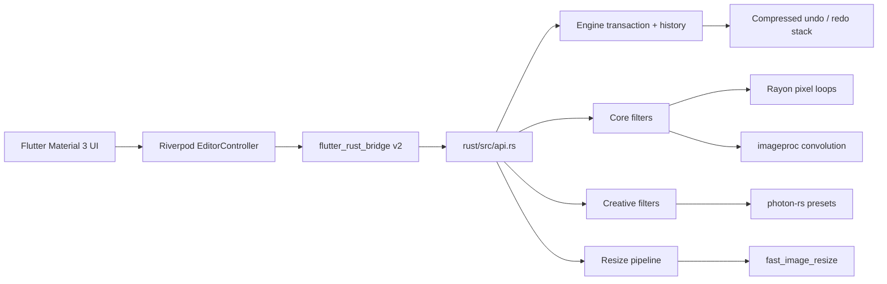

# PixelCraft

PixelCraft is an offline-first image editor with a Material 3 Flutter UI and a native Rust processing engine. Images never need to leave the device.

## Architecture



### Responsibility boundaries

| Layer | Responsibility |
|---|---|
| Flutter | Material 3 UI, gestures, navigation, Riverpod state projection |
| flutter_rust_bridge | Typed Dart-to-Rust bridge and synchronous preview calls |
| PixelCraft engine | Decoding, preview transaction, history, histogram and timing |
| Rayon | Parallel pixel-local brightness, contrast, saturation and blending |
| imageproc | Gaussian blur and sharpen convolution |
| photon-rs | Creative effects and presets |
| fast_image_resize | High-quality Lanczos resizing |

Photon is intentionally used as an internal Rust module rather than through a second Flutter wrapper. This keeps one FFI boundary and lets PixelCraft control memory, history and filter behavior.

## Filters

### Core filters

- Brightness
- Contrast
- Saturation
- Gaussian blur
- Sharpen

Core filters use a normalized `0.0..2.0` control. `1.0` is neutral for brightness, contrast, saturation and sharpen; Gaussian blur starts at `0.0`.

### Photon creative filters

- Grayscale
- Invert
- Vintage
- Oceanic
- Lofi
- Dramatic
- Golden
- Pastel pink

Creative filters use a `0.0..1.0` intensity. PixelCraft applies the Photon effect once and blends its RGB output with the immutable transaction base in parallel using Rayon. Unknown preset names are rejected explicitly instead of accepting Photon’s fallback preset.

## Realtime preview transaction

The editor does not repeatedly apply a slider value on top of the previous frame:

```text
onChangeStart  -> begin_filter(filter)
                   decode current committed preview once

onChanged      -> update_filter_preview(filter, value)
                   clone immutable decoded base
                   process in Rust
                   encode preview
                   do not add history

onChangeEnd    -> commit_filter()
                   add exactly one compressed history entry
```

This fixes two common editor problems:

1. Slider values no longer compound on every tick.
2. A drag gesture creates one undo step rather than dozens of history entries.

A max-1280px preview is generated in Rust for interactive work. The original compressed input remains in the engine for a future full-resolution export pipeline.

## Rust API

- `load_image`
- `prepare_preview`
- `begin_filter`
- `update_filter_preview`
- `commit_filter`
- `cancel_filter`
- `apply_filter` / `apply_filter_timed` — stateless compatibility and benchmark API
- `photon_filter_names`
- `get_histogram` — 768 values: 256 bins per RGB channel
- `resize_image`
- `undo`, `redo`, `current_image`

All interactive APIs use `#[frb(sync)]` as requested. Synchronous native calls reduce scheduling overhead, but they still run on the Dart caller thread. Keep the preview bounded and benchmark on target hardware.

## Requirements

- Flutter 3.22 or newer
- Rust stable
- Android Studio or Xcode platform prerequisites
- `flutter_rust_bridge_codegen` 2.12.0

Pinned Rust dependencies include:

```toml
image = "0.24"
imageproc = "0.23"
rayon = "1.8"
fast_image_resize = "3.0"
photon-rs = "=0.3.3"
flutter_rust_bridge = "=2.12.0"
```


## Makefile workflow

The recommended workflow uses the project Makefile:

```bash
make help
make setup
make run
```

When Android reports that `libpixelcraft_engine.so` is missing, repair and verify the native integration with:

```bash
make frb-info
```

The Makefile invokes the pinned binary at `~/.cargo/bin/flutter_rust_bridge_codegen` and force-reinstalls the requested version when another older executable shadows it on `PATH`.

```bash
make repair
make verify-native
make run
```

Useful targets:

```bash
make codegen          # regenerate FRB bridge files
make codegen-watch    # watch Rust API changes
make check            # Flutter analysis/tests and Rust checks
make run-release      # run on a physical device in release mode
make adb-abi          # print the connected Android device ABI
```

Specify a Flutter device explicitly when needed:

```bash
make run DEVICE=<device-id>
```

## Setup

```bash
unzip PixelCraft.zip
cd PixelCraft
./tool/bootstrap.sh
flutter run
```

The bootstrap script creates missing Flutter platform directories, integrates Cargokit, generates bridge code and downloads Dart packages.

After changing Rust APIs:

```bash
./tool/codegen.sh
```

Continuous code generation:

```bash
./tool/codegen.sh --watch
```

Manual generator installation:

```bash
cargo install flutter_rust_bridge_codegen --version 2.12.0
flutter_rust_bridge_codegen generate
```

## Benchmark

Tap **Benchmark** in the editor. It reports:

1. Filter processing time measured inside Rust.
2. End-to-end synchronous bridge wall time.
3. A simple Dart byte-loop baseline.

Run meaningful tests in release mode on a physical device:

```bash
flutter run --release
```

No fabricated benchmark results are committed. Performance varies by CPU, codec, image size and filter. The `<16ms` value is an interactive-preview target, not a universal guarantee. Gaussian blur and PNG encoding can exceed one frame on slower devices.

## Memory strategy

For a `4000 x 3000` RGBA image, one decoded buffer is about 48 MB. PixelCraft therefore:

- retains the original as compressed bytes;
- processes a bounded preview during interaction;
- keeps undo/redo entries as compressed PNG data;
- decodes one immutable base at gesture start;
- stores only the latest pending preview before commit;
- caps history at 20 entries.

A production full-resolution export should replay committed filter operations against the original or use a tile-based pipeline. Codec-level streaming is not uniformly available across all selected formats in `image 0.24`.

## Code walkthrough

เอกสารอธิบาย runtime flow, Riverpod state, FRB bridge, Rust transaction engine, filters, histogram, undo/redo, benchmark และ memory trade-offs อยู่ที่:

- [`docs/CODE_WALKTHROUGH.md`](docs/CODE_WALKTHROUGH.md)

## Source layout

```text
lib/
  core/bridge.dart
  state/editor_controller.dart
  ui/screens/home_screen.dart
  ui/screens/editor_screen.dart
  ui/widgets/filter_slider.dart
  ui/widgets/histogram_widget.dart
  ui/widgets/image_preview.dart
rust/src/
  api.rs
  engine.rs
  filters.rs
  photon_filters.rs
  lib.rs
flutter_rust_bridge.yaml
```

## Validation

Before publishing a release, run:

```bash
cargo fmt --manifest-path rust/Cargo.toml --check
cargo clippy --manifest-path rust/Cargo.toml --all-targets -- -D warnings
cargo test --manifest-path rust/Cargo.toml
flutter analyze
flutter test
flutter run --release
```

The archive is source-ready, but this generation environment does not include Flutter or Rust toolchains, so native code generation and compilation must be run locally using the commands above.

## License

MIT

## Android: `libpixelcraft_engine.so` not found

This means the FRB Dart bindings were generated, but the Rust native library was not bundled into the APK. Repair the Cargokit integration from the project root:

```bash
make repair
make verify-native
make run
```

Verify the debug APK contains the Android library:

```bash
unzip -l build/app/outputs/flutter-apk/app-debug.apk | grep libpixelcraft_engine.so
```

For a typical physical Android phone, the expected entry is under `lib/arm64-v8a/`.

### Flutter 3.44 / Gradle 9

FRB 2.12.0 bundles a CargoKit Gradle script that still calls `Project.exec`, which
was removed in Gradle 9. PixelCraft patches the generated script automatically
during `make integrate` and `make repair`.

Manual repair:

```bash
make patch-cargokit
make clean-all
make build-apk
```
