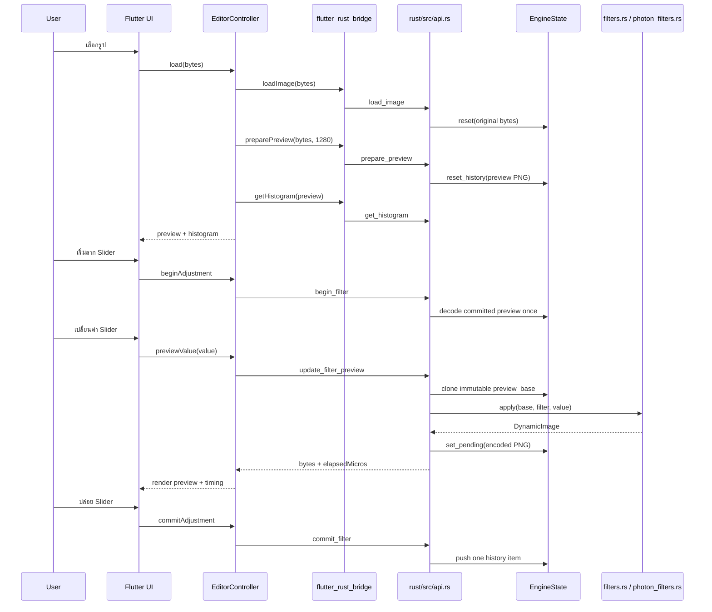

# PixelCraft Code Walkthrough

เอกสารนี้อธิบายการทำงานของ PixelCraft ตั้งแต่เปิดแอป เลือกรูป ลาก Slider ส่งคำสั่งผ่าน `flutter_rust_bridge` ไปยัง Rust ประมวลผลภาพ จนถึงการวาด Histogram และจัดการ Undo/Redo

> เป้าหมายของโครงสร้างนี้คือให้ Flutter รับผิดชอบเฉพาะ UI และ state projection ขณะที่งาน decode, resize, filter, histogram และ history อยู่ใน Rust

---

## 1. ภาพรวมการไหลของข้อมูล



หลักสำคัญคือทุก Slider tick ประมวลผลจากภาพฐานเดียวกัน ไม่ได้นำผล tick ก่อนหน้ามาปรับซ้ำ จึงไม่มี cumulative filter error และหนึ่ง gesture จะสร้าง history เพียงหนึ่งรายการ

---

## 2. Startup และการ initialize Rust bridge

### `lib/main.dart`

จุดเริ่มต้นคือ `main()`:

```dart
void main() {
  WidgetsFlutterBinding.ensureInitialized();
  runApp(const ProviderScope(child: PixelCraftApp()));
}
```

สิ่งสำคัญคือแอปเรียก `runApp()` ทันที ไม่รอ `RustLib.init()` ก่อนวาดเฟรมแรก วิธีนี้ป้องกัน Android ค้างอยู่ที่ launch icon หาก native library โหลดไม่สำเร็จ

`ProviderScope` เป็น root container ของ Riverpod ทำให้ `editorProvider` ใช้งานได้ทุกหน้าภายใต้แอป

### Global error handlers

`FlutterError.onError` รับ Flutter framework errors ส่วน `PlatformDispatcher.instance.onError` รับ uncaught asynchronous/platform errors และพิมพ์ stack trace ลง console

สองส่วนนี้ช่วยให้ startup failure และ runtime error มีข้อมูลมากกว่าการเห็นแอปค้างเฉย ๆ

### `RustBootstrapScreen`

`PixelCraftApp` ใช้ `RustBootstrapScreen` เป็นหน้าแรก โดย `_initialize()` เรียก:

```dart
await initializeRustBridge().timeout(const Duration(seconds: 15));
```

สถานะของ `FutureBuilder` แบ่งเป็นสามกรณี:

1. **กำลังโหลด** — แสดง progress indicator
2. **สำเร็จ** — เปิด `HomeScreen`
3. **ล้มเหลว/timeout** — แสดง error และปุ่ม Retry

### `lib/core/bridge.dart`

`initializeRustBridge()` ครอบ `RustLib.init()` เพื่อให้ initialize เพียงครั้งเดียว:

- `_initialized` ป้องกัน initialize ซ้ำหลังสำเร็จ
- `_initialization` แชร์ Future เดียวกันหากมี caller หลายตัว
- หากล้มเหลว จะ reset `_initialization = null` เพื่อให้ Retry ทำงานจริง

`RustLib` มาจากไฟล์ที่ FRB code generator สร้างใน `lib/src/rust/frb_generated.dart`

---

## 3. หน้า Home และการนำเข้ารูป

### `lib/ui/screens/home_screen.dart`

`HomeScreen` มีแหล่งรูปสองแบบ:

- sample images จาก `assets/samples/`
- รูปจาก Gallery ผ่าน `image_picker`

เมธอด `_openBytes()` รับ `Future<List<int>>` ทำให้ใช้ร่วมกันได้ทั้ง asset bytes และ `XFile.readAsBytes()` จาก Gallery

หลังอ่าน bytes เสร็จ แอป push `EditorScreen`:

```dart
Navigator.of(context).push(
  MaterialPageRoute(
    builder: (_) => EditorScreen(imageBytes: bytes),
  ),
);
```

ในขั้นนี้ยังไม่มีการ decode ภาพใน Dart มีเพียงการอ่าน compressed bytes และส่งต่อไปยัง Editor

---

## 4. Editor state ด้วย Riverpod

### `lib/state/editor_controller.dart`

`EditorState` เป็น immutable state object ที่ Flutter UI ใช้อ่านข้อมูล ได้แก่:

| Field | ความหมาย |
|---|---|
| `originalBytes` | compressed source bytes ที่รับจาก Home |
| `previewBytes` | PNG preview ล่าสุดจาก Rust |
| `histogram` | 768 bins: R, G, B อย่างละ 256 |
| `selectedFilter` | filter ที่เลือกอยู่ |
| `value` | ค่า slider ปัจจุบัน |
| `processingMs` | เวลา filter ที่วัดใน Rust |
| `isBusy` | อยู่ระหว่าง load |
| `isAdjusting` | มี filter transaction ที่ยังไม่ commit |
| `error` | ข้อผิดพลาดล่าสุด |

Provider ถูกประกาศเป็น:

```dart
final editorProvider =
    StateNotifierProvider<EditorController, EditorState>(
  (ref) => EditorController(),
);
```

UI ใช้ `ref.watch(editorProvider)` เพื่อ rebuild เมื่อ state เปลี่ยน และใช้ `ref.read(editorProvider.notifier)` เพื่อเรียก command

### `load()`

เมื่อเปิด Editor จะเรียกตามลำดับ:

```text
loadImage(bytes)
preparePreview(bytes, maxEdge: 1280)
getHistogram(preview)
```

- `loadImage` decode เพื่อตรวจรูปและเก็บ original bytes ใน Rust
- `preparePreview` ย่อภาพด้านยาวไม่เกิน 1280 px
- `getHistogram` คำนวณจาก preview ที่ย่อแล้ว

การเก็บ preview ขนาดจำกัดช่วยลด memory pressure และลดเวลาระหว่างลาก Slider

### `selectFilter()`

หากกำลังปรับค่าอยู่ จะพยายาม `cancelFilter()` ก่อนเปลี่ยน filter เพื่อไม่ให้ transaction เก่าค้างใน Rust

ค่าเริ่มต้น:

- `gaussian_blur` เริ่มที่ `0.0`
- filter อื่นเริ่มที่ `1.0`

Creative filters ใช้ช่วง `0.0..1.0` ส่วน core filters ใช้ `0.0..2.0`

### `beginAdjustment()`

เรียกเมื่อผู้ใช้เริ่มแตะ Slider:

```dart
rust.beginFilter(filter: state.selectedFilter);
```

Rust จะ decode current committed preview เพียงครั้งเดียว แล้วเก็บเป็น immutable `preview_base`

### `previewValue()`

เรียกเมื่อ Slider เปลี่ยนค่า:

```dart
final result = rust.updateFilterPreview(
  filter: state.selectedFilter,
  value: value,
);
```

ผลลัพธ์ `ProcessedImage` มี:

- `bytes` — PNG preview
- `elapsedMicros` — `u64` จาก Rust ซึ่ง FRB map เป็น `BigInt` ใน Dart

จึงต้องแปลงก่อนคำนวณ:

```dart
processingMs: result.elapsedMicros.toDouble() / 1000.0
```

หลัง filter เสร็จ Dart เรียก histogram ใหม่จาก preview bytes และ update state ให้ UI วาดภาพและกราฟใหม่

> ปัจจุบันทั้ง filter และ histogram เป็น synchronous bridge calls บน Dart caller thread หากอุปกรณ์ช้าหรือ preview ใหญ่เกินไป UI ยังมีโอกาสกระตุกได้

### `commitAdjustment()`

เมื่อปล่อย Slider จะเรียก `commitFilter()` เพื่อเพิ่ม output ล่าสุดเข้า history เพียงหนึ่งรายการ

Intermediate previews ระหว่างลากจะไม่ถูกเพิ่มเข้า undo stack

### `undo()` และ `redo()`

ทั้งสอง command ขอ bytes จาก Rust แล้วคำนวณ histogram ใหม่ใน Dart controller ก่อน update state

History pointer และ image entries ไม่ได้อยู่ใน Dart

---

## 5. Editor UI

### `lib/ui/screens/editor_screen.dart`

`EditorScreen` เป็น `ConsumerStatefulWidget` เพราะต้อง:

- รับ initial image bytes
- เรียก controller หลัง widget ถูกสร้าง
- watch Riverpod state

ใน `initState()` ใช้ `Future.microtask()` เพื่อหลีกเลี่ยงการเปลี่ยน provider ระหว่าง widget tree กำลัง build:

```dart
Future.microtask(
  () => ref.read(editorProvider.notifier).load(...),
);
```

หน้าจอแบ่งเป็น:

1. `ImagePreview`
2. `HistogramWidget`
3. Rust processing-time overlay
4. filter chips
5. `FilterSlider`

### Processing overlay

แสดง `state.processingMs` และเปรียบเทียบกับ 16 ms:

```text
Rust 8.42 ms      Within frame budget
```

ค่า 16 ms เป็นเป้าหมายสำหรับประมาณ 60 FPS ไม่ใช่การรับประกัน เพราะเวลาจริงขึ้นกับ device, filter, image size, decode และ PNG encoding

### Filter chips

รายการ filter รวมจาก:

```dart
[...coreFilters, ...creativeFilters]
```

เมื่อเลือก chip จะเรียก `controller.selectFilter(filter)`

---

## 6. Slider transaction และ frame throttle

### `lib/ui/widgets/filter_slider.dart`

`FilterSlider` เก็บ `_value` ภายใน widget เพื่อให้ thumb เคลื่อนทันที แม้ Rust preview ยังประมวลผลไม่เสร็จ

ระหว่าง `onChanged` ใช้ Timer 16 ms:

```dart
_frameThrottle = Timer(
  const Duration(milliseconds: 16),
  () => widget.onChanged(value),
);
```

แนวคิดคือส่งค่าล่าสุดไป Rust สูงสุดประมาณหนึ่งครั้งต่อ frame แทนการเรียกทุก pointer event

เมื่อ `onChangeEnd`:

1. cancel timer ที่ค้าง
2. render final slider value
3. commit history

```dart
widget.onChanged(value);
widget.onChangeEnd(value);
```

จุดที่ควรระวังคือทั้งสอง callback เป็น synchronous ปัจจุบัน ดังนั้นคำสั่ง commit จะทำหลัง final preview call คืนค่าแล้ว ซึ่งถูกต้องสำหรับ transaction แต่ยัง block UI thread ระหว่างประมวลผล

---

## 7. Image preview

### `lib/ui/widgets/image_preview.dart`

ใช้ `Image.memory()` แสดง PNG bytes จาก Rust และห่อด้วย `InteractiveViewer`:

- minimum zoom `0.75x`
- maximum zoom `6x`
- pinch-to-zoom และ pan
- `gaplessPlayback: true` ลดการกระพริบเมื่อเปลี่ยน bytes ต่อเนื่อง

Dart ไม่ได้ทำ image filter ใน widget นี้

---

## 8. Histogram rendering

### `lib/ui/widgets/histogram_widget.dart`

Rust ส่ง histogram จำนวน 768 ค่า:

```text
0..255     Red
256..511   Green
512..767   Blue
```

`_HistogramPainter` หา bin สูงสุดเพื่อ normalize ค่าแต่ละ channel เข้ากับความสูงของ canvas

แต่ละ channel สร้าง path จากด้านล่างซ้าย ผ่าน bins 256 จุด แล้วปิด path กลับลงด้านล่างก่อนวาดแบบโปร่งใส

```dart
path.lineTo(size.width, size.height);
path.close();
```

`lineTo()` คืน `void` จึงห้าม chain `.close()` ต่อท้าย

`shouldRepaint()` เปรียบเทียบ reference/list equality ของ bins เมื่อ controller สร้าง list ใหม่ painter จะ repaint

---

## 9. FRB configuration และ generated code

### `flutter_rust_bridge.yaml`

```yaml
rust_input: crate::api
dart_output: lib/src/rust
rust_root: rust
rust_output: rust/src/frb_generated.rs
dart_entrypoint_class_name: RustLib
```

ความหมาย:

- public API เริ่มจาก Rust module `crate::api`
- Dart bindings ถูกสร้างใน `lib/src/rust`
- Rust glue ถูกสร้างที่ `rust/src/frb_generated.rs`
- Flutter initialize native bridge ผ่าน `RustLib.init()`

เมื่อเปลี่ยน function signature, struct หรือ public Rust API ต้องรัน:

```bash
./tool/codegen.sh
```

ไม่ควรแก้ generated files ด้วยมือ เพราะการ generate ครั้งถัดไปจะเขียนทับ

---

## 10. Rust public API

### `rust/src/api.rs`

ไฟล์นี้เป็น boundary ที่ Flutter เรียกได้ ทุก interactive function ใช้ `#[frb(sync)]`

### `ProcessedImage`

```rust
pub struct ProcessedImage {
    pub bytes: Vec<u8>,
    pub elapsed_micros: u64,
}
```

ใช้ส่งทั้งผลลัพธ์และเวลาที่วัดภายใน Rust กลับ Dart

### `load_image()`

1. decode เพื่อตรวจ format และอ่าน dimensions
2. reset Rust engine
3. เก็บ original compressed bytes
4. คืน `(width, height)`

### `prepare_preview()`

คำนวณ scale จากด้านยาว:

```rust
let scale = (max_edge / max(width, height)).min(1.0);
```

จากนั้นเรียก `resize_image()` และ reset history ให้เริ่มจาก preview PNG

Original bytes ยังถูกเก็บแยกใน engine สำหรับ export pipeline ในอนาคต

### `apply_filter_timed()`

เป็น stateless API:

```text
decode input -> apply filter -> encode PNG -> return bytes/time
```

ใช้ใน Benchmark และ integrations ที่ไม่ต้องการ history transaction

### `begin_filter()`

ส่งต่อไป `EngineState.begin_filter()` เพื่อ capture committed preview เป็น decoded base

### `update_filter_preview()`

ลำดับสำคัญ:

1. lock engine เพื่อ clone `preview_base`
2. ปล่อย lock
3. apply filter
4. encode PNG
5. lock engine อีกครั้งเพื่อเก็บ `pending_preview`

การไม่ถือ mutex ระหว่าง filter processing ป้องกัน lock ถูกครอบงานหนักเกินจำเป็น

### `commit_filter()` / `cancel_filter()`

- commit: push pending preview เข้า history
- cancel: ทิ้ง transaction และคืน committed image ล่าสุด

### `get_histogram()`

ใช้ Rayon แบบ parallel fold/reduce:

- worker แต่ละตัวมี local histogram 768 bins
- scan RGBA chunks ทีละ 4 bytes
- reduce local histograms เข้าด้วยกัน

วิธีนี้หลีกเลี่ยง shared atomic counter สำหรับทุก pixel

### `resize_image()`

ใช้ `fast_image_resize`:

1. decode เป็น RGBA8
2. สร้าง source/destination images
3. resize ด้วย Lanczos3 convolution
4. encode ผลเป็น PNG

ตรวจ width/height ด้วย `NonZeroU32` เพื่อปฏิเสธขนาด 0

---

## 11. Rust engine และ history

### `rust/src/engine.rs`

State กลางประกาศเป็น:

```rust
pub static ENGINE: Lazy<Mutex<EngineState>> = ...;
```

`Lazy` สร้าง state เมื่อใช้ครั้งแรก และ `Mutex` ป้องกัน concurrent access จาก bridge calls

### `EngineState`

| Field | หน้าที่ |
|---|---|
| `original` | compressed original source |
| `history` | committed preview PNG entries |
| `cursor` | ตำแหน่ง undo/redo ปัจจุบัน |
| `preview_base` | decoded immutable base ของ gesture |
| `pending_preview` | encoded preview ล่าสุดก่อน commit |
| `active_filter` | filter ที่ transaction อนุญาตให้ใช้ |

### History behavior

`push()` จะ:

1. truncate redo branch หลัง cursor
2. push image ใหม่
3. จำกัด history ไม่เกิน 20 entries
4. เลื่อน cursor ไปท้ายสุด

ตัวอย่าง:

```text
A -> B -> C
undo ไป B
apply D
ผลลัพธ์: A -> B -> D
C ถูกตัดทิ้ง
```

History ใช้ compressed PNG แทน raw RGBA เพื่อลด RAM แต่มี trade-off คือ undo/redo หรือ gesture ถัดไปต้อง decode PNG อีกครั้ง

### Transaction integrity

`preview_base(filter)` ตรวจว่า `active_filter` ตรงกับ filter ที่ส่งเข้ามา หาก Flutter ส่ง update โดยไม่ได้ begin transaction หรือเปลี่ยนชื่อ filter กลางทาง Rust จะคืน error

---

## 12. Core filters

### `rust/src/filters.rs`

`apply()` เป็น router:

```rust
if photon_filters::is_photon_filter(filter) {
    return photon_filters::apply(...);
}
```

หากไม่ใช่ creative filter จะใช้ core implementation

### Rayon pixel loop

Brightness, contrast และ saturation ใช้ `parallel_map_pixels()`:

```rust
raw.par_chunks_mut(4).for_each(|pixel| { ... });
```

แต่ละ worker แก้ RGBA pixel ของตนเอง จึงไม่ต้อง lock

### Brightness

ค่า neutral คือ `1.0`:

```text
offset = (value - 1.0) * 255
```

### Contrast

ขยาย/บีบระยะจาก midpoint 128:

```text
output = (input - 128) * factor + 128
```

### Saturation

คำนวณ luminance แล้ว interpolate ระหว่าง grayscale กับสีเดิม

### Gaussian blur

ใช้ `imageproc::gaussian_blur_f32` โดย map slider `0..2` ไป sigma สูงสุดประมาณ `5.0`

### Sharpen

สร้าง 3x3 convolution kernel จาก strength แล้วใช้ `filter3x3`

ทุก channel ถูก clamp กลับช่วง `0..255`

---

## 13. Photon creative filters

### `rust/src/photon_filters.rs`

PixelCraft ใช้ Photon เป็น internal Rust module ไม่ได้เพิ่ม Flutter wrapper อีกชั้น

รายชื่อรองรับถูกกำหนดแบบ explicit:

```rust
pub const PHOTON_FILTERS: &[&str] = &[ ... ];
```

เหตุผลคือ Photon preset API อาจมี fallback สำหรับชื่อที่ไม่รู้จัก PixelCraft จึงตรวจชื่อเองเพื่อให้ error ชัดเจน

### Intensity blending

Photon presets สร้าง effect เต็มค่า จากนั้น PixelCraft blend กับ source ด้วย Rayon:

```text
output = source + (effect - source) * intensity
```

- `0.0` = original
- `1.0` = Photon effect เต็ม
- alpha ใช้ค่าจาก original

วิธีนี้ทำให้ creative filters ทั้งหมดใช้ Slider รูปแบบเดียวกัน

---

## 14. Benchmark

### `_showBenchmark()` ใน `editor_screen.dart`

รายงานสามค่า:

1. **Rust filter time** — เวลา decode/filter/encode ที่วัดใน `apply_filter_timed()`
2. **Bridge wall time** — Stopwatch ฝั่ง Dart ครอบ synchronous call ทั้งหมด
3. **Dart byte-loop baseline** — loop อ่าน bytes 20 รอบ

ข้อควรเข้าใจ:

- Dart baseline ปัจจุบันไม่ใช่ image filter ที่ให้ output เท่ากัน
- จึงใช้วัด overhead/CPU baseline แบบหยาบ ไม่ใช่ benchmark เชิงวิทยาศาสตร์ระหว่าง algorithm เดียวกัน
- ควรรัน `flutter run --release` บน physical device
- debug mode มี overhead สูงและไม่เหมาะใช้สรุป performance

Benchmark ที่ยุติธรรมกว่าในอนาคตควร implement brightness algorithm เดียวกันทั้ง Dart และ Rust ใช้ input และจำนวนรอบเท่ากัน พร้อม warm-up ก่อนวัด

---

## 15. Memory model

ภาพ RGBA ขนาด `4000 x 3000` ใช้ raw memory ประมาณ:

```text
4000 × 3000 × 4 = 48,000,000 bytes ≈ 45.8 MiB
```

PixelCraft ลดความเสี่ยง OOM ด้วย:

- original เก็บเป็น compressed bytes
- interactive preview จำกัดด้านยาว 1280 px
- history เก็บ compressed PNG
- gesture เก็บ decoded base หนึ่งชุด
- pending preview เก็บเฉพาะ output ล่าสุด
- จำกัด history 20 รายการ

อย่างไรก็ตาม pipeline ปัจจุบันยัง encode PNG ทุก preview tick และส่ง bytes ข้าม bridge ทุกครั้ง ซึ่งอาจเกิน 16 ms สำหรับ blur หรืออุปกรณ์ระดับล่าง

แนวทาง production ต่อไปคือส่ง raw RGBA buffer/texture handle, ใช้ isolate/async API หรือ native texture และ replay filter operations กับ original ตอน export

---

## 16. จุดที่ควรพัฒนาต่อ

### Performance

- ย้าย synchronous heavy calls ออกจาก UI thread
- แยก filter time ออกจาก PNG encode time
- latest-value-wins เพื่อทิ้ง preview result ที่ล้าสมัย
- cache histogram หรือคำนวณพร้อม filter ใน Rust call เดียว
- ใช้ native texture/shared buffer เพื่อลด PNG encode/decode ระหว่าง preview

### Correctness

- เพิ่ม `canUndo` / `canRedo` API เพื่อ disable ปุ่มตามสถานะจริง
- commit final preview และ histogram ใน call เดียว
- เพิ่ม structured Rust error enum แทน `String`
- รองรับ EXIF orientation และ metadata policy

### Product features

- export full resolution โดย replay operation stack กับ original
- crop, rotate, flip
- non-destructive operation history
- before/after preview
- save/share output

### Testing

ควรเพิ่ม:

- Rust unit tests สำหรับทุก filter และ boundary values
- engine history tests: branch truncation, max history, transaction validation
- histogram tests ด้วยภาพสีคงที่
- resize dimension tests
- Flutter controller tests ด้วย bridge abstraction/mock
- widget tests สำหรับ loading/error/editor state
- integration test สำหรับ import → filter → undo → redo

---

## 17. ลำดับไฟล์สำหรับเริ่มอ่านโค้ด

แนะนำอ่านตามนี้:

1. `lib/main.dart`
2. `lib/core/bridge.dart`
3. `lib/ui/screens/home_screen.dart`
4. `lib/ui/screens/editor_screen.dart`
5. `lib/state/editor_controller.dart`
6. `lib/ui/widgets/filter_slider.dart`
7. `flutter_rust_bridge.yaml`
8. `rust/src/api.rs`
9. `rust/src/engine.rs`
10. `rust/src/filters.rs`
11. `rust/src/photon_filters.rs`
12. generated files ใน `lib/src/rust/` และ `rust/src/frb_generated.rs`

ลำดับนี้เดินตาม runtime flow จาก Flutter startup ไปจนถึง native processing และย้อนกลับมาที่ UI
