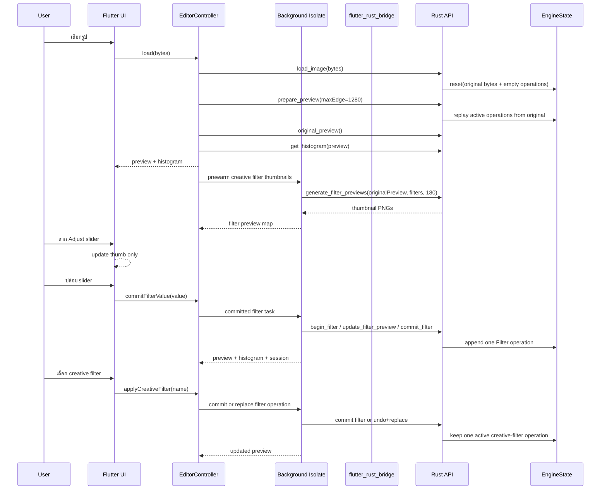

# PixelCraft Code Walkthrough

เอกสารนี้อธิบาย architecture ปัจจุบันของ PixelCraft ตั้งแต่เปิดแอป เลือกรูป ส่งงานผ่าน `flutter_rust_bridge` ไปยัง Rust, operation history, full-resolution export, transform tools, responsive editor และ workflow ของ Adjust/Creative Filters

> หลักการสำคัญคือ Flutter รับผิดชอบ UI และ state projection ส่วนงาน decode, filter, histogram, transform, operation replay และ export อยู่ใน Rust โดยงานหนักที่เรียกผ่าน synchronous FRB API ถูก dispatch ผ่าน background Dart isolate เพื่อลดการ block UI isolate

---

## 1. ภาพรวม data flow



Operation history เป็น source of truth ของ state การแก้ไขทั้งหมด ภาพ preview และ full-resolution export จึงเกิดจากการ replay operation list เดียวกัน ไม่ใช่การสะสม PNG snapshots ทีละขั้น

---

## 2. Startup และ Rust bridge

### `lib/main.dart`

`main()` เรียก `WidgetsFlutterBinding.ensureInitialized()` และสร้าง `ProviderScope` ให้ Riverpod

แอปไม่ block เฟรมแรกเพื่อรอ native library แต่ใช้ bootstrap screen เพื่อ initialize Rust bridge พร้อม error/retry state

### `lib/core/bridge.dart`

`initializeRustBridge()` ทำหน้าที่ initialize `RustLib` เพียงครั้งเดียว โดยแชร์ in-flight Future และ reset state หาก initialization ล้มเหลว เพื่อให้ Retry ทำงานจริง

Background isolate ที่ต้องเรียก FRB จะเรียก `initializeRustBridge()` ภายใน isolate นั้นก่อนใช้งาน native API

---

## 3. Home และการนำเข้ารูป

### `lib/ui/screens/home_screen.dart`

ผู้ใช้เปิดรูปจาก sample asset หรือ Gallery แล้วส่ง compressed bytes ไป `EditorScreen`

Dart ไม่ decode image ที่หน้า Home งาน decode อยู่ใน Rust

---

## 4. Operation-based image engine

### `rust/src/engine.rs`

`EngineState` เก็บข้อมูลหลัก:

- `original` — compressed source image เดิม
- `operations` — รายการ `EditOperation`
- `cursor` — จำนวน operation ที่ active
- `preview_max_edge` — ขนาดสูงสุดของ editor preview
- transaction state ของ filter ที่กำลัง commit

`EditOperation` รองรับ:

- Filter
- Crop
- Rotate 90°
- Rotate degrees / Straighten
- Flip horizontal
- Flip vertical
- Resize

### Replay

`render_full_resolution()` decode original แล้ว replay operation ตั้งแต่ index `0..<cursor`

`render_preview()` ใช้ผล replay เดียวกัน แต่ย่อให้ไม่เกิน `preview_max_edge`

ข้อดีคือ preview และ export ใช้ semantics เดียวกัน และการ Undo/Redo ไม่ต้องเก็บ full image ทุก state

---

## 5. Undo / Redo ด้วย operation cursor

Undo ลด `cursor` ลงหนึ่ง ส่วน Redo เพิ่ม `cursor` หากยังมี operation ด้านหน้า

หาก Undo แล้ว commit operation ใหม่ engine จะ truncate redo tail ก่อน append operation ใหม่

`session_info()` ส่งข้อมูลกลับ Flutter:

- operation count
- cursor
- canUndo
- canRedo
- session version

Flutter ใช้ข้อมูลนี้เปิด/ปิดปุ่ม Undo/Redo และแสดง `Editor · cursor/operationCount edits`

---

## 6. Editor state และ background processing

### `lib/state/editor_controller.dart`

`EditorState` เป็น immutable projection สำหรับ UI โดยเก็บ:

- original / preview bytes
- histogram
- selected Adjust filter
- selected creative filter
- creative filter intensity
- creative filter thumbnail map
- selected tool
- straighten value
- processing timing
- busy/export states
- operation cursor state

งาน filter/transform/undo/redo/export ถูกเรียกผ่าน abstraction ใน `ImageEngine`

### `lib/core/image_engine.dart`

`RustImageEngine` มี synchronous methods สำหรับ native API โดยตรง และ background methods ที่ใช้ `Isolate.run()` สำหรับงานที่อาจใช้เวลานาน

ตัวอย่าง background operation:

```text
Flutter UI isolate
    -> Isolate.run
        -> Rust FRB sync API
        -> histogram
        -> session_info
    <- EngineCommitResult
```

ผลคือ pointer/scroll/animation บน UI isolate ไม่ต้องรอ synchronous native call โดยตรง

---

## 7. Adjust controls: process ตอนปล่อย slider เท่านั้น

### `lib/ui/widgets/filter_slider.dart`

`FilterSlider` อัปเดต `_value` ภายใน widget ตอนลาก เพื่อให้ thumb และตัวเลขตอบสนองทันที

ระหว่าง `onChanged` ไม่มี Rust processing

เมื่อผู้ใช้ปล่อย thumb จึงเรียก `onChangeEnd` เพียงครั้งเดียว

### Adjust flow

```text
ลาก slider
  -> Flutter local state only

ปล่อย slider
  -> EditorController.commitFilterValue(value)
  -> background isolate
  -> Rust begin_filter
  -> Rust update_filter_preview(final value)
  -> Rust commit_filter
  -> operation history +1
```

ดังนั้นหนึ่ง slider gesture เท่ากับหนึ่ง committed operation และไม่มี realtime image processing ระหว่างลาก

---

## 8. Creative Filters

Creative filters ได้แก่ grayscale, invert, vintage, oceanic, lofi, dramatic, golden และ pastel pink

### ไม่มี default filter

เมื่อเข้า Filters ครั้งแรก `selectedCreativeFilter` เป็นค่าว่าง จึงไม่มี filter ไหนถูกเลือกโดยอัตโนมัติ

### Thumbnail preview prewarming

หลัง `load()` รูปเสร็จ Controller จะเริ่ม generate filter thumbnails ล่วงหน้าแบบ fire-and-forget โดยไม่ต้องรอให้ผู้ใช้เปิด Filters

Source ของ thumbnail คือ `originalPreviewBytes` ที่ได้จากรูปก่อน creative filter selection ดังนั้น thumbnails มีหน้าที่เป็น style reference ที่คงที่ ไม่ใช่ exact preview ของ operation chain ล่าสุด

ผลคือเปิด Filters แล้วโดยปกติ thumbnails พร้อมใช้งาน และ thumbnails ไม่ถูก regenerate ทุกครั้งที่ผู้ใช้ลอง filter ใหม่

### Fast Rust thumbnail generation

`rust/src/api.rs::generate_filter_previews()` ทำงานแบบ batch:

1. decode source เพียงครั้งเดียว
2. resize source เพียงครั้งเดียวให้ด้านยาวประมาณ 180 px
3. apply creative filters จาก thumbnail base เดียวกัน
4. ใช้ Rayon ประมวลผล filter variants แบบ parallel
5. encode thumbnail แต่ละตัวเป็น PNG

วิธีนี้เร็วกว่า implementation เดิมที่ decode + filter รูป preview ขนาดใหญ่ซ้ำทีละ filter

### Filter selection ไม่ stack ต่อกัน

คำว่า base ในส่วนนี้หมายถึง image state ก่อน active creative-filter operation ไม่จำเป็นต้องเป็น raw original image หากก่อนหน้านั้นมี Adjust/Crop/Rotate อยู่แล้ว

เมื่อเลือก creative filter ตัวแรก ระบบ append Filter operation หนึ่งรายการ

ถ้ากด filter ตัวอื่น ระบบใช้ `replaceFilterValue()` ซึ่ง undo active creative filter ก่อน แล้ว commit filter ใหม่จาก base เดิม

ดังนั้นหาก base ปัจจุบันคือ `Adjusted + Cropped`:

```text
Adjusted + Cropped -> Vintage
```

แล้วเปลี่ยนเป็น Oceanic จะเป็น:

```text
Adjusted + Cropped -> Oceanic
```

ไม่ใช่:

```text
Adjusted + Cropped -> Vintage -> Oceanic
```

operation count จึงไม่เพิ่มทุกครั้งที่ลอง filter ใหม่

### Creative filter intensity slider

หลังเลือก filter แล้ว UI จะแสดง intensity slider ช่วง `0.0..1.0`

ระหว่างลากเปลี่ยนเฉพาะ thumb/value เมื่อปล่อยจึงเรียก `updateCreativeFilterValue()` และ replace active creative-filter operation เดิม

ตัวอย่าง `Vintage 1.00 -> Vintage 0.45` ยังคงเป็น Filter operation เดียว

---

## 9. Crop / Rotate / Flip / Straighten

Transform tools เป็น replayable operations ทั้งหมด

Crop มี centered presets 1:1, 4:3, 3:4, 16:9 และ 9:16 โดยส่ง normalized coordinates ไป Rust

Rotate รองรับ quarter-turn ซ้าย/ขวา และ Flip รองรับ horizontal/vertical

Straighten ใช้ช่วง -15°..15° โดยระหว่างลากเปลี่ยนเฉพาะ Flutter state และ commit ตอนปล่อย slider

---

## 10. Before / After

`original_preview()` สร้าง preview จาก original source image

`EditorState.visiblePreview` สลับระหว่าง original preview กับ edited preview ตาม `showOriginal`

Editor ใช้ long-press gesture เพื่อแสดง original ชั่วคราว

---

## 11. Full-resolution export

Export ไม่ upscale preview แต่เรียก Rust ให้ replay active operations จาก original resolution

รองรับ PNG, JPEG พร้อม quality และ WebP

`ExportFileService` บันทึกไฟล์ลง app documents และเปิด system share sheet ได้

ปัจจุบันยังไม่ได้เขียนเข้า Android Gallery / iOS Photos โดยตรง

---

## 12. Responsive Editor UI

`EditorScreen` ใช้ `LayoutBuilder`: compact width วาง canvas ด้านบนและ controls ด้านล่าง ส่วน width >= 900 px ใช้ canvas ซ้าย + side tool panel ขวา

`EditorToolPanel` มี Adjust, Filters, Crop, Rotate และ Details

Tool navigation เลื่อนได้แนวนอนบนหน้าจอแคบ และระหว่าง heavy committed operation จะ disable controls พร้อม processing overlay

---

## 13. Histogram

Rust คำนวณ RGB histogram 768 bins: Red 0..255, Green 256..511 และ Blue 512..767 โดยใช้ Rayon aggregate pixels

---

## 14. flutter_rust_bridge code generation

เมื่อ Rust public API เปลี่ยน ต้อง regenerate bridge files:

```bash
make codegen
```

การเพิ่ม `generate_filter_previews()` เปลี่ยน FRB API ดังนั้นต้อง commit generated bridge files หลังรัน codegen

---

## 15. Testing strategy

Rust unit tests ครอบคลุม filters, operation replay, undo/redo, redo-tail truncation และ transforms

Controller/widget tests ครอบคลุม commit-only Adjust slider, prewarmed creative thumbnails, no default filter, filter replacement, creative intensity replacement, transforms, undo/redo และ export

เมื่อ Filters UI เปลี่ยนต้อง regenerate Golden baseline และ review รูปก่อน commit

---

## 16. Validation ก่อน merge

```bash
flutter pub get
make codegen
cargo fmt --manifest-path rust/Cargo.toml --all
cargo clippy --manifest-path rust/Cargo.toml --all-targets -- -D warnings
cargo test --manifest-path rust/Cargo.toml
flutter analyze
flutter test test/state
flutter test test/ui --exclude-tags=golden
make golden-update
make golden-test
make verify-native
make native-test DEVICE=RF8Y909V0LV
```

ควร run แอปจริงเพิ่มเติมเพื่อประเมิน interaction latency ของภาพขนาดใหญ่

---

## 17. ข้อจำกัดที่ยังเหลือ

- interactive crop frame ยังไม่มี
- direct save เข้า system photo library ยังไม่มี
- native operation cancellation ยังไม่มี
- full-resolution export ยังอาจใช้เวลาหลายวินาทีสำหรับไฟล์ขนาดใหญ่มาก
- creative thumbnails เป็น style reference จาก original preview จึงไม่เปลี่ยนตาม Adjust/Transform ล่าสุด เพื่อแลกกับความเร็วและความคงที่ของตัวเลือก

---

## สรุป architecture

```text
Flutter UI / local slider state
        |
        v
EditorController / Riverpod
        |
        +--> thumbnail prewarm isolate
        |       |
        |       v
        |   Rust batch thumbnail generator
        |
        +--> committed-operation isolate
                |
                v
         flutter_rust_bridge
                |
                v
             Rust API
                |
                v
      EngineState + EditOperation
                |
       +--------+---------+
       |                  |
    Preview          Full-resolution
       |                  |
       +--------+---------+
                |
             Export
```

หัวใจของ PixelCraft คือ operation-based non-destructive editing: Flutter ไม่ถือ image history เอง และ UI interaction ที่ถี่ไม่ควร trigger expensive image processing ทุก event ขณะที่ Rust เป็นผู้ replay operation และสร้าง output ทั้ง preview และ full-resolution export
